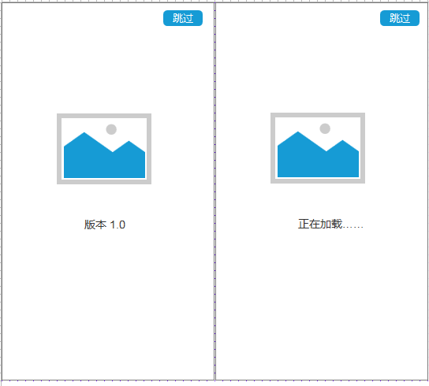

## 欢迎页的实现步骤

#### 欢迎页的方式

1.常见的欢迎页一般为一个图标，下方是一个版本，或者是一个图标，一个进度条的方式，显示2到3s之后自动消失，还有一种是为了急需的处理，那就是通过按下页面会自动的进入到页面里面。

#### 欢迎页的实现

- 首先实现欢迎页面的布局

  ```
  <?xml version="1.0" encoding="utf-8"?>
  <RelativeLayout xmlns:android="http://schemas.android.com/apk/res/android"
      xmlns:app="http://schemas.android.com/apk/res-auto"
      xmlns:tools="http://schemas.android.com/tools"
      android:layout_width="match_parent"
      android:background="#FFFFFF"
      android:layout_height="match_parent"
      tools:context=".SplashActivity">
      <ImageView
          android:id="@+id/iv_splash_icon"
          android:layout_centerInParent="true"
          android:layout_width="80dp"
          android:src=""
          android:layout_height="80dp" />
      <LinearLayout
          android:layout_marginTop="9dp"
          android:layout_centerHorizontal="true"
          android:layout_below="@id/iv_splash_icon"
          android:gravity="center"
          android:orientation="horizontal"
          android:layout_width="wrap_content"
          android:layout_height="wrap_content">
          <ProgressBar
              android:layout_width="30dp"
              android:layout_height="30dp" />
          <TextView
              android:layout_marginLeft="8dp"
              android:text="@string/starting"
              android:textSize="18sp"
              android:layout_width="wrap_content"
              android:layout_height="wrap_content" />
      </LinearLayout>
  </RelativeLayout>
  ```

  上面的布局是

  

  无论是哪种方式，都没有太多逻辑。

- 在代码中实现3s之后跳转

  对于第一种的实现，其实第一种和第二种的就是，第二种需要加载一次版本信息。对于2秒的处理，可以有多种处理方式。

  - 第一种：

    ```java
    handler.postDelayed(new Runnable() {
          @Override
          public void run() {
                //两秒之后执行，执行在主线程，在那么new,就在哪里执行
               startMainActivity();
          }
      },2000);
    ```

    

  - 第二种：通过发送消息的方式，我感觉上面这样还好吧，代码少点。

- 上面的完全可以跳转，如果我们需要快速进入，比如

  

  我们通过按钮点击事件，然后启动，这种解决方法可以很方便的解决问题，此时也带了了一个问题。

  **问题描述：**我们按错了，那么我们会赶紧按下返回，但是3s之后，又会回到启动主页面。

  **处理方式:**点击返回之后，会将handler清除，还

  **问题：**会创建多个页面，那么我们通过设置单例来解决，也可以通过设置变量判断来解决。

  ```xml
  <activity android:name=".Maintivity" android:launchMode="singleTask"></activity>
  ```

  

https://github.com/wangwangla/anzhuomoban/tree/ed81b3ff0c4e8631790f2f89b26978032789d790