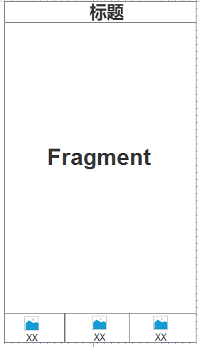

## 底部导航栏的实现

自定义底部导航栏，这里使用的是RadioGroup实现，实现步骤如下：

#### 书写主页面

**主页面分析:**上面是一个Fragment，下面是一系列点击按钮。



中间使用的是一个权重的方式，确定其大小。

```xml
<?xml version="1.0" encoding="utf-8"?>
<LinearLayout xmlns:android="http://schemas.android.com/apk/res/android"
    android:layout_width="match_parent"
    android:orientation="vertical"
    android:layout_height="match_parent">
    <!--标题栏-->
    <!--Fragment-->
    <FrameLayout
        android:id="@+id/fl_main_content"
        android:layout_width="match_parent"
        android:layout_weight="1"
        android:layout_height="wrap_content"></FrameLayout>
    <!--底部状态栏-->
    <RadioGroup
        android:id="@+id/rg_buttom_tag"
        android:padding="3dp"
        android:gravity="center_vertical"
        android:background="#11000000"
        android:layout_width="match_parent"
        android:orientation="horizontal"
        android:layout_height="wrap_content">
        <RadioButton
            style="@style/bottom_tag_style"
            android:id="@+id/rb_video"
            android:drawableTop="@drawable/rb_video_drawable_selector"
            android:text="@string/local_video" />
        <RadioButton
            style="@style/bottom_tag_style"
            android:id="@+id/rb_audio"
            android:drawableTop="@drawable/rb_audio_drawable_selector"
            android:text="@string/local_audio" />
        <RadioButton
            style="@style/bottom_tag_style"
            android:id="@+id/rb_net_video"
            android:drawableTop="@drawable/rb_net_video_drawable_selector"
            android:text="@string/net_video" />
        <RadioButton
            style="@style/bottom_tag_style"
            android:id="@+id/rb_net_audio"
            android:drawableTop="@drawable/rb_net_audio_drawable_selector"
            android:text="@string/net_audio" />
    </RadioGroup>
</LinearLayout>
```

这个里面需要注意的是点击之后的点击状态,我们使用的是RadioGroup，所以是选中和不选中。

```xml
<?xml version="1.0" encoding="utf-8"?>
<selector xmlns:android="http://schemas.android.com/apk/res/android">
    <item android:state_checked="false" android:drawable="@drawable/ic_tab_audio"></item>
    <item android:state_checked="true" android:drawable="@drawable/ic_tab_audio_press"></item>
</selector> 
```

#### 自定义布局样式

在实现的过程中，有许多样式是可以进行重复使用的，那么就可以将其设置一个样式，然后进入即可。

```xml
   <style name="bottom_tag_style">
        <item name="android:button">@android:color/transparent</item>
        <item name="android:layout_gravity">center_vertical</item>
        <item name="android:gravity">center</item>
        <item name="android:layout_width">wrap_content</item>
        <item name="android:drawablePadding">3dp</item>
        <item name="android:textColor">@drawable/rb_video_text_selector</item>
        <item name="android:layout_height">wrap_content</item>
        <item name="android:textSize">10sp</item>
        <item name="android:layout_weight">1</item>
    </style>
```

### 显示页面，给页面一个默认选中状态

```java
setContentView(R.layout.activity_main);
fl_main_content = findViewById(R.id.fl_main_content);
rg_buttom_tag = findViewById(R.id.rg_buttom_tag);
//默认选中
rg_buttom_tag.check(R.id.rb_video);
```

### BasePager书写

```
public abstract class BasePager {
    //构造方法将试图创建  孩子强制继承
    //初始化子页面的数据
    private Context context;

    private View rootview;
    public BasePager(Context context){
        this.context = context;
        rootview = initView();
    }

    /**
     * 强制实现
     * @return
     */
    public abstract View initView();

    /**
     * 绑定数据的时候，重写方法
     */
    public void initData(){}

}
```

#### 引入两个工具类

#### 创建四个页面

```
/*本地视频
 */
public class VideoPager extends BasePager {
    public VideoPager(Context context){
        super(context);
    }
    private TextView textView ;

    @Override
    public View initView() {
        textView = new TextView(context);
        textView.setTextSize(40);
        return textView;
    }

    @Override
    public void initData() {
        textView.setText("本地视频");
    }
}


public class NetVideoPager extends BasePager {
    public NetVideoPager(Context context){
        super(context);
    }
    private TextView textView ;

    @Override
    public View initView() {
        textView = new TextView(context);
        textView.setTextSize(40);
        return textView;
    }

    @Override
    public void initData() {
        textView.setText("网络视频");
    }
}


public class NetAudioPager extends BasePager {
    public NetAudioPager(Context context){
        super(context);
    }
    private TextView textView ;

    @Override
    public View initView() {
        textView = new TextView(context);
        textView.setTextSize(40);
        return textView;
    }

    @Override
    public void initData() {
        textView.setText("网络音乐");
    }
}


public class AudioPager extends BasePager {
    public AudioPager(Context context){
        super(context);
    }
    private TextView textView ;

    @Override
    public View initView() {
        textView = new TextView(context);
        textView.setTextSize(40);

        return textView;
    }

    @Override
    public void initData() {
        textView.setText("本地音乐");
    }
}
```

#### 页面跳转的实现

我们一个四个页面，点击不同的按钮进入到不同的页面，那么我们可以将其放入到一个集合中，方便取出数据。我们同时需要监听按钮按下的是哪一个。

- 监听按下的是哪一个

```
rg_buttom_tag.setOnCheckedChangeListener(new MyOnCheckedChangeListener());
class MyOnCheckedChangeListener implements RadioGroup.OnCheckedChangeListener{
        @Override
        public void onCheckedChanged(RadioGroup group, int checkedId) {
            switch (checkedId){
                default:
                    position = 0;
                    break;
                case R.id.rb_audio:
                    position = 1;
                    break;
                case R.id.rb_net_video:
                    position = 2;
                    break;
                case R.id.rb_net_audio:
                    position = 3;
                    break;
            }
            setFragment();
        }
  按钮按下之后，我们设置哪一个被按下，然后通过setFragment进行显示哪一个页面
```

设置页面

```
    private void setFragment() {
        //1、得到FragmentManagment
        FragmentManager manager = getSupportFragmentManager();
        //2、开始事物
        FragmentTransaction ft = manager.beginTransaction();
        //3、替换
        ft.replace(R.id.fl_main_content,new MyFragment(basePagers.get(position)));
        basePagers.get(position).initData();
        //4、提交
        ft.commit();
    }
}
```

```java
public class MyFragment extends Fragment {
    public MyFragment(){

    }
    private BasePager currPager;

    @SuppressLint("ValidFragment")
    public MyFragment(BasePager pager) {
        this.currPager=pager;
    }
    @Override
    public void onCreate(Bundle savedInstanceState) {
        super.onCreate(savedInstanceState);
    }

    @Override
    public View onCreateView(LayoutInflater inflater, ViewGroup container,
                             Bundle savedInstanceState) {
        return currPager.rootview;
    }

}
```

上面的实现，就是通过RadioGroup得到哪一个被按下，然后将其记录下来，去集合中将相应的页面取出来。然后进行显示。